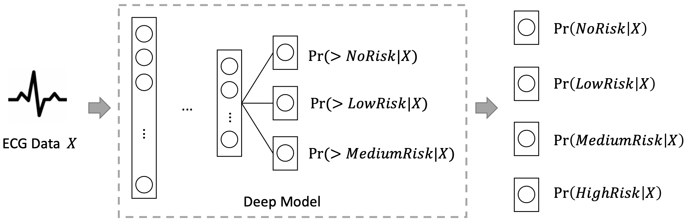

# CardioV: Estimating critical values from electrocardiogram using a deep ordinal convolutional neural network

Guodong Wei, Xinxin Di, Wenrui Zhang, Shijia Geng, Deyun Zhang, Kai Wang, Zhaoji Fu, Shenda Hong. Estimating Critical Values from Electrocardiogram using a Deep Ordinal Convolutional Neural Network. BMC Medical Informatics and Decision Making 22, 295 (2022). https://doi.org/10.1186/s12911-022-02035-w

## What we do?

In our study, we propose CardioV, an ordinal classifier, to estimate ECG critical value categories that can help people quickly identify different heart health conditions. Test results show that the model performs well in all four critical value categories. Furthermore, we observe three phenomena: extreme values (0 and 3) have better model performance than the other two; gender does not affect the performance; the older age group has worse performance than the younger age group. We also find that the agreement of model-cardiologist is comparable with that of cardiologist-cardiologist. The ablation study reveals that CardioV outperforms baseline deep learning models and validates that ordinal classification is suitable for identifying categories with ranking information. In addition, we interpret our model through activation visualization techniques, and discover that the model pays more attention to characteristic ECG locations, whether in “rhythm-type” or “beat-type” arrhythmia.

## Availability of data and materials

The PTB-XL ECG dataset used in this study is available on the PhysioNet website https://physionet.org/content/ptb-xl/1.0.1/. The code of CardioV can be downloaded from the github repository: https://github.com/hsd1503/CardioV. We also deploy our trained model and create an online application: https://www.heartvoice.com.cn/criticalvalue/index_en. With the application, users can test the critical value analysis function using their own data or the provided sample data.
